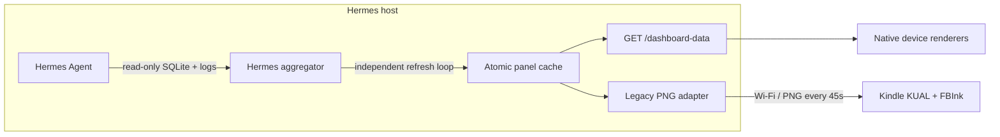

# Hermes E-Ink Dashboard

A standalone, read-only local dashboard gateway for [Hermes Agent](https://github.com/NousResearch/hermes-agent). It runs beside Hermes, refreshes sanitized state independently of HTTP requests, and exposes a versioned JSON contract for device-side E-Ink renderers. The original Kindle PNG client remains available as a compatibility adapter.

> **This is the single, canonical repo.** The former `hermes-kindle-dashboard`
> repo has been consolidated here — Kindle is now one adapter behind a
> device-neutral contract, not a separate project. The Python package was
> renamed `hermes_kindle_dashboard` → `hermes_eink_dashboard`; the old import
> path and the `hermes-kindle-dashboard` console command still work as
> deprecated aliases. See [`CONSOLIDATION.md`](CONSOLIDATION.md).

## One-liner install (Linux host)

```bash
curl -fsSL https://raw.githubusercontent.com/NicoMancinelli/hermes-eink-dashboard/main/install.sh | bash
```

That's it. The installer:

- Creates `~/.local/share/hermes-eink-dashboard/venv` and installs the package.
- Generates a bearer token at `~/.config/hermes-eink-dashboard/token`.
- Installs a hardened `systemd --user` service named `hermes-eink-dashboard`.
- Starts the service on `127.0.0.1:9120` (override with `--bind` / `--port`).

Common flags (pipe after `bash -s --`):

```bash
curl -fsSL https://raw.githubusercontent.com/NicoMancinelli/hermes-eink-dashboard/main/install.sh \
  | bash -s -- --bind 192.168.1.42 --port 9120 --refresh-seconds 15
```

Verify with:

```bash
systemctl --user status hermes-eink-dashboard
curl -fsSL http://127.0.0.1:9120/healthz
```

Then build the Kindle bundle and copy it to the device:

```bash
gh repo clone NicoMancinelli/hermes-eink-dashboard
cd hermes-eink-dashboard
# Build a portable template bundle (no real tokens; safe to publish):
python3 scripts/build_kual_bundle.py --output dist/hermes-dashboard-kual.zip
# Copy dist/hermes-dashboard-kual.zip to your Kindle and unzip it under
# /mnt/us/extensions/, then run bin/post_install.sh on the Kindle to
# configure the host + tokens.
```

For personal/dev builds that embed real tokens directly (do NOT publish these):

```bash
python3 scripts/build_kual_bundle.py   --inject-tokens   --host 192.168.1.42   --token-file ~/.config/hermes-kindle-dashboard/token
```

## What it shows

- Current Hermes session, model, source, tool, message/tool counts
- Approximate context-window use
- Active session todos and local Hermes kanban work
- Long-term memory counts and profile size
- Sanitized recent agent events (never raw terminal/tool output)

The Kindle UI provides **Start Dashboard**, **Manual Refresh**, and **Stop Dashboard** actions.

## Architecture



No Hermes source patch is required. The service only reads `~/.hermes/state.db`, `kanban.db`, `memory_store.db`, memory markdown, and structured agent logs. API requests never trigger SQLite, log, or provider collection work.

## Repository layout

```text
kindle/hermes_dashboard/     KUAL extension source
  menu.json
  config.xml
  config.sh.example
  bin/{start,fetch,refresh,stop}.sh
src/hermes_eink_dashboard/
  aggregators/              independent panel providers
  contract.py               versioned device-neutral panel cache
  scheduler.py              serial refresh loops and backoff
  state.py                   read-only Hermes state collector
  render.py                  responsive E-Ink renderer
  api.py                     FastAPI service and compatibility routes
  server.py                  CLI and Uvicorn entry point
systemd/                     hardened user service
scripts/
  install_host.sh            host installer
  uninstall_host.sh          host uninstaller
  build_kual_bundle.py       tokenized Kindle ZIP builder
tests/                       collector, renderer, HTTP, and KUAL tests
```

## Requirements

### Host

- Linux with Python 3.10+
- A working Hermes Agent installation
- `systemd --user` (for the provided installer)
- Host and Kindle on the same trusted LAN, or another network route the Kindle can reach

### Kindle

- Jailbreak + KUAL
- [FBInk](https://github.com/NiLuJe/FBInk) installed as a KUAL extension or available in `PATH`
- Wi-Fi access to the host

## Touch input

Most modern Kindles (Paperwhite 2+, Voyage, Oasis, Scribe) have a
capacitive touchscreen. The interactive client reads it via
`/dev/input/event1` (or any device you pass with `--touch-device`). The
client expects to be running on a jailbroken Kindle with:

- `/dev/input/event1` readable by the user (default path; pass
  `--touch-device /path/to/eventN` to override).
- The Kindle's `EV_ABS` resolution matches the layout `grid_size` returned
  by the host (default 1072 × 1448 for Paperwhite 3 / Oasis 3). For other
  resolutions, pass `--touch-device-size WxH` to enable rescaling.

Tap detection: `BTN_TOUCH` press marks the start, release marks the end.
Inside a single tile, this synthesizes a `focus` event on press and an
`activate` event on release (tap). A drag (press in tile A, release in tile
B) emits a focus event for B on release, with no activate.

There is no multi-touch support in v0.4 (the Kindle touchscreen is
single-touch). Long-press, pinch, and gestures are not recognized.


## Install from source (alternative)

If you'd rather not pipe to bash, clone the repo and run the installer directly:

```sh
git clone https://github.com/NicoMancinelli/hermes-eink-dashboard.git
cd hermes-eink-dashboard

# The safe default is 127.0.0.1. For a Kindle on your LAN, bind only to
# the Hermes host's LAN address rather than 0.0.0.0.
./scripts/install_host.sh --bind 192.168.1.50 --port 9120 \
  --width 1072 --height 1448 --context-limit 262144 \
  --refresh-seconds 15
```

The installer creates:

- isolated venv: `~/.local/share/hermes-kindle-dashboard/venv`
- private config: `~/.config/hermes-kindle-dashboard/host.env`
- private random read token: `~/.config/hermes-kindle-dashboard/token`
- private random control token: `~/.config/hermes-kindle-dashboard/control_token`
- user service: `~/.config/systemd/user/hermes-kindle-dashboard.service`

The control token enables `POST /control`, `GET /control/events`,
`GET /config`, and `POST /config`. Without it, those endpoints return
`503 Service Unavailable` (the read token does not silently grant write
access). The KUAL bundle for your Kindle can either embed both tokens
(personal mode) or use placeholders that you fill in via
`bin/post_install.sh` after copying to the Kindle.

Verify it without exposing the token:

```sh
systemctl --user status hermes-kindle-dashboard
curl -fsS http://192.168.1.50:9120/healthz
TOKEN=$(cat ~/.config/hermes-kindle-dashboard/token)
curl -fsS -H "Authorization: Bearer $TOKEN" \
  http://192.168.1.50:9120/dashboard-data -o /tmp/dashboard-data.json
curl -fsS "http://192.168.1.50:9120/dashboard.png?token=$TOKEN" \
  -o /tmp/hermes-dashboard.png
file /tmp/hermes-dashboard.png
```

If the host firewall blocks the port, allow TCP 9120 **only from the Kindle/LAN subnet**. Do not expose this service to the public internet.

## Build and install the KUAL extension

The bundle builder has two modes:

### Template mode (default, safe to publish)

```sh
python3 scripts/build_kual_bundle.py --output dist/hermes-dashboard-kual.zip
```

Produces a ZIP with placeholder tokens (`HOST_IP=PLACEHOLDER.lan`,
`DASHBOARD_TOKEN=PLACEHOLDER_TOKEN`). Use this when uploading to GitHub
releases or sharing with other users.

### Personal mode (embeds real tokens; do NOT publish)

```sh
python3 scripts/build_kual_bundle.py \
  --inject-tokens \
  --host 192.168.1.50 \
  --port 9120 \
  --token-file ~/.config/hermes-kindle-dashboard/token \
  --control-token-file ~/.config/hermes-kindle-dashboard/control_token \
  --output dist/hermes-dashboard-kual-personal.zip
```

Use this for your own device. The bundle will work without any post-install
step.

### Install on the Kindle

1. Connect the Kindle over USB.
2. Extract the ZIP so the final path is `/mnt/us/extensions/hermes_dashboard/menu.json`.
3. Confirm FBInk is installed. The client checks:
   - `/mnt/us/extensions/FBInk/bin/fbink`
   - `/mnt/us/extensions/fbink/bin/fbink`
   - `/usr/bin/fbink` and `PATH`
4. **Template-mode bundles only**: run `bin/post_install.sh` (interactively,
   or pass `--host`, `--port`, `--read-token`, and optionally `--control-token`).
5. Disconnect USB and open KUAL.
6. Choose **Hermes Dashboard → Start Dashboard**.

The `post_install.sh` script replaces placeholder values in `config.sh` with
real ones. It is idempotent and safe to re-run.

**Stop Dashboard** terminates the fetch loop, restores `preventScreenSaver=0`,
and restarts the Amazon UI. If the host is unreachable, FBInk shows one clean
offline screen and continues retrying without repeated flashing.

## Display sizes

The renderer is responsive. Set exact framebuffer dimensions in `host.env` or rerun the installer. Common starting points:

| Device class | Width × height |
|---|---:|
| Older Kindle | 600 × 800 |
| Paperwhite 3 | 1072 × 1448 |
| Oasis 2/3 | 1264 × 1680 |
| Paperwhite 5 | 1236 × 1648 |
| Scribe | 1860 × 2480 |

If orientation or visible dimensions differ, use `fbink -e` on the Kindle to inspect its framebuffer and rebuild/reconfigure with those values.

## Manual development run

```sh
python3 -m venv .venv
.venv/bin/pip install -e '.[dev]'
.venv/bin/pytest

# Render from live Hermes state without starting HTTP.
.venv/bin/hermes-eink-dashboard \
  --render-once /tmp/hermes-dashboard.png --width 600 --height 800

# Local-only HTTP server.
TOKEN=development-only
.venv/bin/hermes-eink-dashboard --host 127.0.0.1 --port 9120 --token "$TOKEN"
```

## HTTP API

| Endpoint | Auth | Response |
|---|---|---|
| `GET /healthz` | none | `{"status":"ok"}` |
| `GET /dashboard-data` | bearer only | versioned device-neutral panel data |
| `GET /dashboard.json` | bearer or `?token=` | schema v2 tile layout (interactive clients) |
| `GET /dashboard.png` | bearer or `?token=` | deprecated Kindle-compatible E-Ink PNG |
| `GET /state.json` | bearer or `?token=` | deprecated pre-v1 Hermes state |
| `POST /control` | bearer (control token) | dispatch a tile action (replay-protected) |
| `GET /control/events` | bearer (control token) | long-poll for action results |

`/dashboard-data` is the permanent renderer interface. Each panel carries `_meta.status`, `updated_at`, `last_attempt_at`, and a sanitized `error_code`. A failed refresh retains the last successful data with status `stale`; a panel with no successful data is `unavailable`. Clients must ignore unknown fields and reject unsupported `schema_version` values.

```json
{
  "schema_version": 1,
  "generated_at": "2026-07-24T19:00:00+00:00",
  "panels": {
    "hermes": {
      "_meta": {
        "status": "ok",
        "updated_at": "2026-07-24T19:00:00+00:00",
        "last_attempt_at": "2026-07-24T19:00:00+00:00",
        "error_code": null
      },
      "session": {},
      "tasks": [],
      "memory": {},
      "recent_events": []
    }
  }
}
```

Query auth is restricted to the deprecated routes because BusyBox `wget` header support varies across Kindle firmware. Uvicorn access logging is disabled so those query tokens are not logged.

## Interactive client

The Kindle client (`kindle/client/interactive.py`) supports both 5-way nav
and touchscreen input:

- **5-way nav**: standard Kindle direction pad. Key codes 103/108/105/106
  are mapped to up/down/left/right; 28 is select.
- **Touch** (Paperwhite 3+, Voyage, Oasis, Scribe): reads `/dev/input/event1`
  using `EV_ABS` + `BTN_TOUCH`. Single-touch protocol A (`ABS_X`/`ABS_Y`) and
  multi-touch protocol B (`ABS_MT_POSITION_X`/`Y`) are both handled.
- Coordinates are mapped to tile ids via `Layout.tile_at()` using the
  layout's `grid_size` from the host. Optional `--touch-device-size WxH`
  rescales if the device pixel space differs from the layout grid.
- The client is multiplexed via `CombinedSource` so a Kindle with both
  inputs works transparently.

The host-side interactive layer is in place:

- Schema v2 tile layout at `GET /dashboard.json` with focus highlighting.
- `POST /control` validates allowlist, 60s nonce dedup, ±30s timestamp window, and per-action rate limit (default 1/s).
- `GET /control/events` returns long-poll responses when an action is dispatched.
- `render_layout_dashboard()` paints a tile grid with a 2px focus border around the focused tile.
- `--layout-yaml` flag loads a custom layout from YAML.
- `--focus-tile` / `focus_tile_id` query parameter on `/dashboard.png`
  highlights the focused tile in the rendered PNG.
- Declarative `/config` endpoint lets the host push KUAL config changes
  to `~/.config/hermes-kindle-dashboard/config.yaml`.

**Requirements for the interactive client on the Kindle**: Python 3 (install
via `mrpackage` if not already present). The legacy read-only `fetch.sh`
loop in the KUAL bundle does NOT require Python.

### Interactive flow example

1. Kindle connects to the LAN and resolves `HOST_IP`.
2. KUAL → Hermes Dashboard → **Start Interactive Dashboard** launches
   `bin/start_interactive.sh`, which finds `python3` (via mrpackage's
   `/mnt/us/python3/bin/python3` or `PATH`) and execs the bundled
   `bin/interactive_client.py`.
3. The client reads `GET /dashboard.json` to learn the layout.
4. On a 5-way button press or touch tap, the client computes the next
   focused tile via `Layout.neighbor()` (5-way) or `Layout.tile_at(x, y)`
   (touch).
5. The client refetches `GET /dashboard.png?focus_tile_id=<id>` so the
   focus border updates.
6. On Select (5-way) or tap-up (touch), the client sends
   `POST /control` with the focused tile's `action`.
7. The host validates, dispatches the handler in a thread pool
   (so the request returns immediately), and publishes to
   `GET /control/events` long-poll subscribers.
8. The host's renderer regenerates `/dashboard.png` so the next refresh
   reflects any state change from the action.

## Security and privacy

- Bind to one LAN/Tailscale address, not `0.0.0.0`.
- A random token is mandatory unless `--insecure` is explicitly used.
- Raw message bodies, terminal output, and tool results are not emitted.
- Agent log parsing uses a small allowlist of structured tool/API events.
- The state collector opens SQLite read-only and sets `PRAGMA query_only=ON`.
- Provider failures return stable error codes, not exception text or upstream responses.
- Generated KUAL ZIPs contain the token: keep `dist/` private.

### Interactive Controls Security

- **Dual-Token Model**: Read endpoints use the read token (`--token`), while write/control endpoints (`POST /control`, `GET /control/events`) require a separate control token (`--control-token`). When `control_token` is empty/unset, control endpoints return `503 Service Unavailable` rather than degrading to the read token.
- **Action Allowlist & Prefix Matching**: Only registered actions matching the allowlist (or allowlist prefix rules like `alert.dismiss.*` or `context.set.*`) are accepted.
- **Replay Protection & Rate Limits**: `POST /control` enforces a 60s TTL nonce deduplication window, server timestamp validation (±30s), and per-action rate limiting (default 1/s).
- **Hardened Error Handling & Input Limits**: 400/403/429 error responses return stable generic codes (`invalid_timestamp`, `invalid_nonce`, `invalid_payload`, `forbidden`, `rate_limited`) without reflecting user bytes or internal exception strings. Action configuration (`actions.yaml`) is capped at 1MB to prevent parser DoS. Security headers (`Cache-Control: no-store`, `X-Content-Type-Options: nosniff`, `X-Frame-Options: DENY`) are enforced across all endpoints.

## Packaging and extension

The package has no dependency on this repository's checkout after installation. `install_host.sh` creates an isolated virtual environment and generic private configuration under XDG directories. Other Hermes users can install it on the same Linux account that runs Hermes and select their own bind address, token, display size, context limit, and refresh interval.

New devices should consume `/dashboard-data` and render locally. New data sources implement the small async aggregator protocol and receive their own refresh loop and cache metadata; they must not add provider calls to request handlers. The server-rendered PNG route remains only until the existing Kindle client is replaced.

See [SECURITY.md](SECURITY.md) for reporting and deployment guidance.

## Troubleshooting

```sh
journalctl --user -u hermes-kindle-dashboard -n 100 --no-pager
curl -v http://HOST:9120/healthz
```

Kindle logs are written to `/mnt/us/documents/hermes-dashboard.log`. If KUAL disappears after start, that is expected when the Amazon framework is stopped; choose **Stop Dashboard** only after restarting KUAL/framework manually, or run `/mnt/us/extensions/hermes_dashboard/bin/stop.sh` over SSH/USBNet.

## Credits

Design and lifecycle patterns are informed by:

- [NiLuJe/FBInk](https://github.com/NiLuJe/FBInk)
- [thecodedose/kdashboard](https://github.com/thecodedose/kdashboard)
- [pascalw/kindle-dash](https://github.com/pascalw/kindle-dash)
- [mattzzw/kindle-weatherstation](https://github.com/mattzzw/kindle-weatherstation)

## License

MIT — see [LICENSE](LICENSE).
