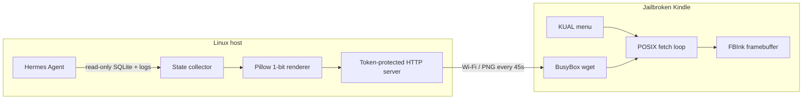

# Hermes Kindle Dashboard

A standalone, read-only E-Ink dashboard for [Hermes Agent](https://github.com/NousResearch/hermes-agent). A Linux host renders live Hermes state to a high-contrast PNG; a jailbroken Kindle fetches it and displays it through FBInk from a KUAL menu.

## What it shows

- Current Hermes session, model, source, tool, message/tool counts
- Approximate context-window use
- Active session todos and local Hermes kanban work
- Long-term memory counts and profile size
- Sanitized recent agent events (never raw terminal/tool output)

The Kindle UI provides **Start Dashboard**, **Manual Refresh**, and **Stop Dashboard** actions.

## Architecture



No Hermes source patch is required. The host service only reads `~/.hermes/state.db`, `kanban.db`, `memory_store.db`, memory markdown, and structured agent logs.

## Repository layout

```text
kindle/hermes_dashboard/     KUAL extension source
  menu.json
  config.xml
  config.sh.example
  bin/{start,fetch,refresh,stop}.sh
src/hermes_kindle_dashboard/
  state.py                   read-only Hermes state collector
  render.py                  responsive E-Ink renderer
  server.py                  stdlib HTTP service
systemd/                     hardened user service
scripts/
  install_host.sh            host installer
  uninstall_host.sh          host uninstaller
  build_kual_bundle.py       tokenized Kindle ZIP builder
tests/                       collector, renderer, HTTP, and KUAL tests
```

## Requirements

### Host

- Linux with Python 3.10+
- A working Hermes Agent installation
- `systemd --user` (for the provided installer)
- Host and Kindle on the same trusted LAN, or another network route the Kindle can reach

### Kindle

- Jailbreak + KUAL
- [FBInk](https://github.com/NiLuJe/FBInk) installed as a KUAL extension or available in `PATH`
- Wi-Fi access to the host

## Install the host

```sh
git clone https://github.com/NicoMancinelli/hermes-kindle-dashboard.git
cd hermes-kindle-dashboard

# Safe default is 127.0.0.1. For a Kindle on your LAN, bind only to the
# host's LAN address rather than 0.0.0.0.
./scripts/install_host.sh --bind 192.168.1.50 --port 9120 \
  --width 1072 --height 1448 --context-limit 262144
```

The installer creates:

- isolated venv: `~/.local/share/hermes-kindle-dashboard/venv`
- private config: `~/.config/hermes-kindle-dashboard/host.env`
- private random token: `~/.config/hermes-kindle-dashboard/token`
- user service: `~/.config/systemd/user/hermes-kindle-dashboard.service`

Verify it without exposing the token:

```sh
systemctl --user status hermes-kindle-dashboard
curl -fsS http://192.168.1.50:9120/healthz
TOKEN=$(cat ~/.config/hermes-kindle-dashboard/token)
curl -fsS -H "Authorization: Bearer $TOKEN" \
  http://192.168.1.50:9120/dashboard.png -o /tmp/hermes-dashboard.png
file /tmp/hermes-dashboard.png
```

If the host firewall blocks the port, allow TCP 9120 **only from the Kindle/LAN subnet**. Do not expose this service to the public internet.

## Build and install the KUAL extension

Build a ZIP using the same Kindle-reachable host and the private token created above:

```sh
python3 scripts/build_kual_bundle.py \
  --host 192.168.1.50 \
  --port 9120 \
  --output dist/hermes-dashboard-kual.zip
```

The generated ZIP contains `hermes_dashboard/config.sh` with the host and token. `dist/` is gitignored.

1. Connect the Kindle over USB.
2. Extract the ZIP so the final path is:
   `/mnt/us/extensions/hermes_dashboard/menu.json`
3. Confirm FBInk is installed. The client checks:
   - `/mnt/us/extensions/FBInk/bin/fbink`
   - `/mnt/us/extensions/fbink/bin/fbink`
   - `/usr/bin/fbink` and `PATH`
4. Disconnect USB and open KUAL.
5. Choose **Hermes Dashboard → Start Dashboard**.

**Stop Dashboard** terminates the fetch loop, restores `preventScreenSaver=0`, and restarts the Amazon UI. If the host is unreachable, FBInk shows one clean offline screen and continues retrying without repeated flashing.

## Display sizes

The renderer is responsive. Set exact framebuffer dimensions in `host.env` or rerun the installer. Common starting points:

| Device class | Width × height |
|---|---:|
| Older Kindle | 600 × 800 |
| Paperwhite 3 | 1072 × 1448 |
| Oasis 2/3 | 1264 × 1680 |
| Paperwhite 5 | 1236 × 1648 |
| Scribe | 1860 × 2480 |

If orientation or visible dimensions differ, use `fbink -e` on the Kindle to inspect its framebuffer and rebuild/reconfigure with those values.

## Manual development run

```sh
python3 -m venv .venv
.venv/bin/pip install -e '.[dev]'
.venv/bin/pytest

# Render from live Hermes state without starting HTTP.
.venv/bin/hermes-kindle-dashboard \
  --render-once /tmp/hermes-dashboard.png --width 600 --height 800

# Local-only HTTP server.
TOKEN=development-only
.venv/bin/hermes-kindle-dashboard --host 127.0.0.1 --port 9120 --token "$TOKEN"
```

## HTTP API

| Endpoint | Auth | Response |
|---|---|---|
| `GET /healthz` | none | `{"status":"ok"}` |
| `GET /dashboard.png` | bearer or `?token=` | E-Ink PNG |
| `GET /state.json` | bearer or `?token=` | sanitized dashboard state |

Bearer auth is preferred for normal clients. Query auth exists because BusyBox `wget` support varies across Kindle firmware. Request paths are deliberately omitted from server logs so query tokens are not logged.

## Security and privacy

- Bind to one LAN/Tailscale address, not `0.0.0.0`.
- A random token is mandatory unless `--insecure` is explicitly used.
- Raw message bodies, terminal output, and tool results are not emitted.
- Agent log parsing uses a small allowlist of structured tool/API events.
- The state collector opens SQLite read-only and sets `PRAGMA query_only=ON`.
- Generated KUAL ZIPs contain the token: keep `dist/` private.

See [SECURITY.md](SECURITY.md) for reporting and deployment guidance.

## Troubleshooting

```sh
journalctl --user -u hermes-kindle-dashboard -n 100 --no-pager
curl -v http://HOST:9120/healthz
```

Kindle logs are written to `/mnt/us/documents/hermes-dashboard.log`. If KUAL disappears after start, that is expected when the Amazon framework is stopped; choose **Stop Dashboard** only after restarting KUAL/framework manually, or run `/mnt/us/extensions/hermes_dashboard/bin/stop.sh` over SSH/USBNet.

## Credits

Design and lifecycle patterns are informed by:

- [NiLuJe/FBInk](https://github.com/NiLuJe/FBInk)
- [thecodedose/kdashboard](https://github.com/thecodedose/kdashboard)
- [pascalw/kindle-dash](https://github.com/pascalw/kindle-dash)
- [mattzzw/kindle-weatherstation](https://github.com/mattzzw/kindle-weatherstation)

## License

MIT — see [LICENSE](LICENSE).
