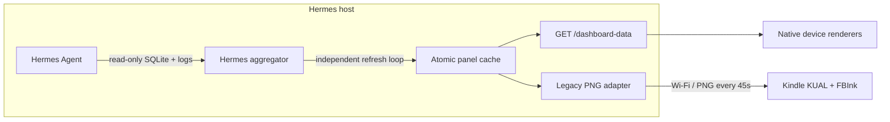

# Hermes E-Ink Dashboard

A standalone, read-only local dashboard gateway for [Hermes Agent](https://github.com/NousResearch/hermes-agent). It runs beside Hermes, refreshes sanitized state independently of HTTP requests, and exposes a versioned JSON contract for device-side E-Ink renderers. The original Kindle PNG client remains available as a compatibility adapter.

## One-liner install (Linux host)

```bash
curl -fsSL https://raw.githubusercontent.com/NicoMancinelli/hermes-eink-dashboard/main/install.sh | bash
```

That's it. The installer:

- Creates `~/.local/share/hermes-eink-dashboard/venv` and installs the package.
- Generates a bearer token at `~/.config/hermes-eink-dashboard/token`.
- Installs a hardened `systemd --user` service named `hermes-eink-dashboard`.
- Starts the service on `127.0.0.1:9120` (override with `--bind` / `--port`).

Common flags (pipe after `bash -s --`):

```bash
curl -fsSL https://raw.githubusercontent.com/NicoMancinelli/hermes-eink-dashboard/main/install.sh \
  | bash -s -- --bind 192.168.1.42 --port 9120 --refresh-seconds 15
```

Verify with:

```bash
systemctl --user status hermes-eink-dashboard
curl -fsSL http://127.0.0.1:9120/healthz
```

Then build the Kindle bundle and copy it to the device:

```bash
gh repo clone NicoMancinelli/hermes-eink-dashboard
cd hermes-eink-dashboard
python3 scripts/build_kual_bundle.py --host 192.168.1.42 --port 9120
# Copy dist/hermes-dashboard-kual.zip to your Kindle and install via KUAL.
```

## What it shows

- Current Hermes session, model, source, tool, message/tool counts
- Approximate context-window use
- Active session todos and local Hermes kanban work
- Long-term memory counts and profile size
- Sanitized recent agent events (never raw terminal/tool output)

The Kindle UI provides **Start Dashboard**, **Manual Refresh**, and **Stop Dashboard** actions.

## Architecture



No Hermes source patch is required. The service only reads `~/.hermes/state.db`, `kanban.db`, `memory_store.db`, memory markdown, and structured agent logs. API requests never trigger SQLite, log, or provider collection work.

## Repository layout

```text
kindle/hermes_dashboard/     KUAL extension source
  menu.json
  config.xml
  config.sh.example
  bin/{start,fetch,refresh,stop}.sh
src/hermes_kindle_dashboard/
  aggregators/              independent panel providers
  contract.py               versioned device-neutral panel cache
  scheduler.py              serial refresh loops and backoff
  state.py                   read-only Hermes state collector
  render.py                  responsive E-Ink renderer
  api.py                     FastAPI service and compatibility routes
  server.py                  CLI and Uvicorn entry point
systemd/                     hardened user service
scripts/
  install_host.sh            host installer
  uninstall_host.sh          host uninstaller
  build_kual_bundle.py       tokenized Kindle ZIP builder
tests/                       collector, renderer, HTTP, and KUAL tests
```

## Requirements

### Host

- Linux with Python 3.10+
- A working Hermes Agent installation
- `systemd --user` (for the provided installer)
- Host and Kindle on the same trusted LAN, or another network route the Kindle can reach

### Kindle

- Jailbreak + KUAL
- [FBInk](https://github.com/NiLuJe/FBInk) installed as a KUAL extension or available in `PATH`
- Wi-Fi access to the host

## Install from source (alternative)

If you'd rather not pipe to bash, clone the repo and run the installer directly:

```sh
git clone https://github.com/NicoMancinelli/hermes-eink-dashboard.git
cd hermes-eink-dashboard

# The safe default is 127.0.0.1. For a Kindle on your LAN, bind only to
# the Hermes host's LAN address rather than 0.0.0.0.
./scripts/install_host.sh --bind 192.168.1.50 --port 9120 \
  --width 1072 --height 1448 --context-limit 262144 \
  --refresh-seconds 15
```

The installer creates:

- isolated venv: `~/.local/share/hermes-kindle-dashboard/venv`
- private config: `~/.config/hermes-kindle-dashboard/host.env`
- private random token: `~/.config/hermes-kindle-dashboard/token`
- user service: `~/.config/systemd/user/hermes-kindle-dashboard.service`

Verify it without exposing the token:

```sh
systemctl --user status hermes-kindle-dashboard
curl -fsS http://192.168.1.50:9120/healthz
TOKEN=$(cat ~/.config/hermes-kindle-dashboard/token)
curl -fsS -H "Authorization: Bearer $TOKEN" \
  http://192.168.1.50:9120/dashboard-data -o /tmp/dashboard-data.json
curl -fsS "http://192.168.1.50:9120/dashboard.png?token=$TOKEN" \
  -o /tmp/hermes-dashboard.png
file /tmp/hermes-dashboard.png
```

If the host firewall blocks the port, allow TCP 9120 **only from the Kindle/LAN subnet**. Do not expose this service to the public internet.

## Build and install the KUAL extension

Build a ZIP using the same Kindle-reachable host and the private token created above:

```sh
python3 scripts/build_kual_bundle.py \
  --host 192.168.1.50 \
  --port 9120 \
  --output dist/hermes-dashboard-kual.zip
```

The generated ZIP contains `hermes_dashboard/config.sh` with the host and token. `dist/` is gitignored.

1. Connect the Kindle over USB.
2. Extract the ZIP so the final path is:
   `/mnt/us/extensions/hermes_dashboard/menu.json`
3. Confirm FBInk is installed. The client checks:
   - `/mnt/us/extensions/FBInk/bin/fbink`
   - `/mnt/us/extensions/fbink/bin/fbink`
   - `/usr/bin/fbink` and `PATH`
4. Disconnect USB and open KUAL.
5. Choose **Hermes Dashboard → Start Dashboard**.

**Stop Dashboard** terminates the fetch loop, restores `preventScreenSaver=0`, and restarts the Amazon UI. If the host is unreachable, FBInk shows one clean offline screen and continues retrying without repeated flashing.

## Display sizes

The renderer is responsive. Set exact framebuffer dimensions in `host.env` or rerun the installer. Common starting points:

| Device class | Width × height |
|---|---:|
| Older Kindle | 600 × 800 |
| Paperwhite 3 | 1072 × 1448 |
| Oasis 2/3 | 1264 × 1680 |
| Paperwhite 5 | 1236 × 1648 |
| Scribe | 1860 × 2480 |

If orientation or visible dimensions differ, use `fbink -e` on the Kindle to inspect its framebuffer and rebuild/reconfigure with those values.

## Manual development run

```sh
python3 -m venv .venv
.venv/bin/pip install -e '.[dev]'
.venv/bin/pytest

# Render from live Hermes state without starting HTTP.
.venv/bin/hermes-kindle-dashboard \
  --render-once /tmp/hermes-dashboard.png --width 600 --height 800

# Local-only HTTP server.
TOKEN=development-only
.venv/bin/hermes-kindle-dashboard --host 127.0.0.1 --port 9120 --token "$TOKEN"
```

## HTTP API

| Endpoint | Auth | Response |
|---|---|---|
| `GET /healthz` | none | `{"status":"ok"}` |
| `GET /dashboard-data` | bearer only | versioned device-neutral panel data |
| `GET /dashboard.json` | bearer or `?token=` | schema v2 tile layout (interactive clients) |
| `GET /dashboard.png` | bearer or `?token=` | deprecated Kindle-compatible E-Ink PNG |
| `GET /state.json` | bearer or `?token=` | deprecated pre-v1 Hermes state |
| `POST /control` | bearer (control token) | dispatch a tile action (replay-protected) |
| `GET /control/events` | bearer (control token) | long-poll for action results |

`/dashboard-data` is the permanent renderer interface. Each panel carries `_meta.status`, `updated_at`, `last_attempt_at`, and a sanitized `error_code`. A failed refresh retains the last successful data with status `stale`; a panel with no successful data is `unavailable`. Clients must ignore unknown fields and reject unsupported `schema_version` values.

```json
{
  "schema_version": 1,
  "generated_at": "2026-07-24T19:00:00+00:00",
  "panels": {
    "hermes": {
      "_meta": {
        "status": "ok",
        "updated_at": "2026-07-24T19:00:00+00:00",
        "last_attempt_at": "2026-07-24T19:00:00+00:00",
        "error_code": null
      },
      "session": {},
      "tasks": [],
      "memory": {},
      "recent_events": []
    }
  }
}
```

Query auth is restricted to the deprecated routes because BusyBox `wget` header support varies across Kindle firmware. Uvicorn access logging is disabled so those query tokens are not logged.

## Interactive client (Phase 1+2)

The host-side interactive layer is in place:

- Schema v2 tile layout at `GET /dashboard.json` with focus highlighting.
- `POST /control` validates allowlist, 60s nonce dedup, ±30s timestamp window, and per-action rate limit (default 1/s).
- `GET /control/events` returns long-poll responses when an action is dispatched.
- `render_layout_dashboard()` paints a tile grid with a 2px focus border around the focused tile.
- `--layout-yaml` flag loads a custom layout from a simple key:value file.
- `--focus-tile` query parameter on `/dashboard.png` highlights the focused tile in the rendered PNG.

The Kindle interactive client (5-way + touch) lands in Phase 3. The legacy read-only Kindle client continues to work unchanged.

## Security and privacy

- Bind to one LAN/Tailscale address, not `0.0.0.0`.
- A random token is mandatory unless `--insecure` is explicitly used.
- Raw message bodies, terminal output, and tool results are not emitted.
- Agent log parsing uses a small allowlist of structured tool/API events.
- The state collector opens SQLite read-only and sets `PRAGMA query_only=ON`.
- Provider failures return stable error codes, not exception text or upstream responses.
- Generated KUAL ZIPs contain the token: keep `dist/` private.

## Packaging and extension

The package has no dependency on this repository's checkout after installation. `install_host.sh` creates an isolated virtual environment and generic private configuration under XDG directories. Other Hermes users can install it on the same Linux account that runs Hermes and select their own bind address, token, display size, context limit, and refresh interval.

New devices should consume `/dashboard-data` and render locally. New data sources implement the small async aggregator protocol and receive their own refresh loop and cache metadata; they must not add provider calls to request handlers. The server-rendered PNG route remains only until the existing Kindle client is replaced.

See [SECURITY.md](SECURITY.md) for reporting and deployment guidance.

## Troubleshooting

```sh
journalctl --user -u hermes-kindle-dashboard -n 100 --no-pager
curl -v http://HOST:9120/healthz
```

Kindle logs are written to `/mnt/us/documents/hermes-dashboard.log`. If KUAL disappears after start, that is expected when the Amazon framework is stopped; choose **Stop Dashboard** only after restarting KUAL/framework manually, or run `/mnt/us/extensions/hermes_dashboard/bin/stop.sh` over SSH/USBNet.

## Credits

Design and lifecycle patterns are informed by:

- [NiLuJe/FBInk](https://github.com/NiLuJe/FBInk)
- [thecodedose/kdashboard](https://github.com/thecodedose/kdashboard)
- [pascalw/kindle-dash](https://github.com/pascalw/kindle-dash)
- [mattzzw/kindle-weatherstation](https://github.com/mattzzw/kindle-weatherstation)

## License

MIT — see [LICENSE](LICENSE).
